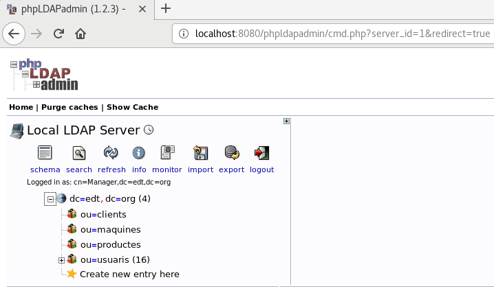
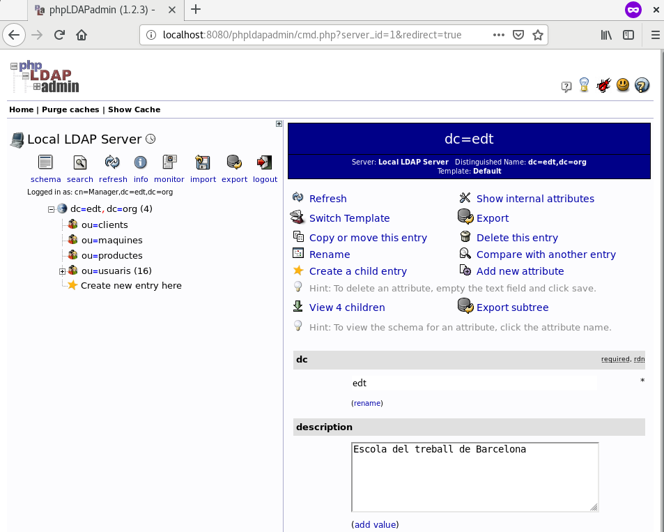

# The Crazy Thing!

[Teoria](Teoria.md)

# Índex

- [Exercici 15 - Ldap-remot i phpldapadmin-local](#Exemple-15-Ldap-remot-i-phpldapadmin-local)
  - [Ldap-remot a Amazon](#Desplegar-el-servei-ldap)
  - [Phpldapadmin local a l'aula o a casa](#Desplegar-el-servei-phpldapadmin)
- [Exercici 16 - Ldap-local i phpldapadmin-remot](#Exemple-16.-Ldap-local-i-phpldapadmin-remot)
  - [Túnel Invers](#Obrim-el-túnel-invers)
  - [Prova del correcte funcionament](#Comprovem)

## Exemple-15 Ldap-remot i phpldapadmin-local

Desplegem dins d’un container Docker (host-remot) en una AMI (host-destí) el servei ldap amb el firewall de la AMI només obrint el port 22. Localment al host de l’aula (host-local) desplegem un container amb phpldapadmin. Aquest container ha de poder accedir a les dades ldap. des del host de l’aula volem poder visualitzar el phpldapadmin.

### Desplegar el servei ldap

- en el host-remot AMI AWS EC2 engegar un container ldap sense fer map dels ports.

```bash
# Ens connectem
[Pau@portatil]$ ssh -i new_key.pem fedora@54.152.97.180

# Arranquem un contenidor
[root@ip-172-31-84-39 ~]$ docker run --rm --name ldapserver.edt.org -h ldapserver.edt.org --net mynet -d isx46420653/k19:ldapserver
```

-  en la ami cal obrir únicament el port 22

```bash
# Comprovem els ports oberts a la AMI, també podem comprovar els Security Groups de l'instància.
[root@ip-172-31-84-39 ~]$ nmap localhost
Not shown: 999 closed ports
PORT   STATE SERVICE
22/tcp open  ssh

Nmap done: 1 IP address (1 host up) scanned in 1.68 seconds
```

-  També cal configurar el /etc/hosts de la AMI per poder accedir al container ldap per nom de host (preferentment).

```bash
# Assignem la direcció del contenidor per poder accedir per nom quan creem el túnel
[root@ip-172-31-84-39 ~]$ echo "172.18.0.2 ldapserver.edt.org" >> /etc/hosts
[root@ip-172-31-84-39 ~]$ cat /etc/hosts
127.0.0.1   localhost localhost.localdomain localhost4 localhost4.localdomain4
::1         localhost localhost.localdomain localhost6 localhost6.localdomain6

172.18.0.2 ldapserver.edt.org
```

-  verificar que des del host de l’aula (host-local) podem fer consultes ldap.

```bash
# Creem el túnel directe al port 50000 que connecta amb el host destí d'Amazon,
# i aquest redirigeix el túnel a ldapserver.edt.org al port 389.
[Pau@portatil]$ ssh -i new_key.pem -L 50000:ldapserver.edt.org:389 fedora@54.152.97.180

# Comprovem que podem fer consultes

[Pau@portatil]$ ldapsearch -x -LLL -h localhost -p 50000 dn

dn: dc=edt,dc=org

dn: ou=maquines,dc=edt,dc=org

dn: ou=clients,dc=edt,dc=org

. . .
```

### Desplegar el servei phpldapadmin

-  engegar en el host de l’aula (host-local) un container docker amb el servei phpldapadmin fent map del seu port 8080 al host-local (o no).

```bash
# Hem de canviar la configuració, per això el creem interactivament
# No cal mapejar el port però és més còmode i no costa res
[Pau@portatil]$ docker run --rm --name phpldapadmin -h phpldapadmin -p 8080:80 --net mynet -it isx46420653/phpldapadmin /bin/bash
```

- crear el túnel directe ssh des del host de l’aula (host-local) al servei ldap (host-remot) connectant via SSH al host AMI (host-destí).

```bash
# Obrim un túnel directe desde el host local cap a la xarxa mynet on està el contenidor LDAP,
# al port 50000 que redireccionarà al port 389 del host ldapserver.edt.org.
[Pau@portatil]$ ssh -i new_key.pem -L 172.18.0.1:50000:ldapserver.edt.org:389 fedora@54.152.97.180
```

-  configurar el phpldapadmin per que trobi la base de dades ldap accedint al host de l’aula al port acabat de crear amb el túnel directe ssh.

```bash
# El servidor passa a ser l'entrada del túnel que redirecciona al contenidor LDAP d'Amazon
[root@phpldapadmin phpldapadmin]$ vi config.php

    $servers->setValue('server','host','172.18.0.1');

    $servers->setValue('server','port',50000);

    $servers->setValue('server','base',array('dc=edt,dc=org'));

# Arranquem
[root@phpldapadmin phpldapadmin]$ bash startup.sh
```

-  Ara ja podem visualitzar des del host de l’aula el servei phpldapadmin, accedint al
  port 8080 del container phpldapadmin o al port que hem fet map del host de l’aula (si
  és que ho hem fet).

```bash
# Accedim amb firefox al port mapejat
[Pau@portatil]$ firefox localhost:8080/phpldapadmin

# En cas de no haver mapejat el port
# 172.19.0.2 és la direcció del contenidor php
[Pau@portatil]$ firefox 172.19.0.2/phpldapadmin/

# Fem login:
user:'cn=Manager,dc=edt,dc=org'
password:'secret'
```

### Ja tenim accés



## Exemple-16. Ldap-local i phpldapadmin-remot

Obrir localment un ldap al host. Engegar al AWS un container phpldapadmin que usa el ldap del host de l’aula. Visualitzar localment al host de l’aula el phpldapadmin del container de AWS EC2. Ahí ez nà.

### Engegar ldap i phpldapadmin i que tinguin connectivitat:

- Engegar localment el servei ldap al host-local de l’aula.

```bash
# Arranquem el servidor LDAP mapejant el port 389
[Pau@portatil]$ docker run --rm --name ldapserver.edt.org -h ldapserver.edt.org -p 389:389 --net mynet -d isx46420653/k19:ldapserver
```

-  Obrir un túnel invers SSH en la AMI de AWS EC2 (host-destí) lligat al servei ldap del host-local de l’aula.

```bash
# Cal modificar la directiva GatewayPorts del servidor SSHD per a fer bind a diferents interfícies
[root@ip-172-31-84-39 ~]$ vi /etc/ssh/sshd_config
. . .

#AllowAgentForwarding yes
#AllowTcpForwarding yes
GatewayPorts yes
X11Forwarding yes
#X11DisplayOffset 10
#X11UseLocalhost yes
#PermitTTY yes

. . .
```

**IMPORTANT**

Cal reiniciar el servei sshd per a que s'apliquin els canvis

```bash
[root@ip-172-31-84-39 ~]$ systemctl restart sshd
```

### Obrim el túnel invers

```bash
# Si mapejem el port, és més còmode
[Pau@portatil]$ ssh -i new_key.pem -R 172.18.0.1:50000:localhost:389 fedora@54.224.177.131

# Si no l'hem mapejat hem de posar la direcció del contenidor local LDAP
[Pau@portatil]$ ssh -i new_key.pem -R 172.18.0.1:50000:172.19.0.2:389 fedora@54.224.177.131
```

-  Engegar el servei phpldapadmin en un container Docker dins de la màquina AMI. cal configurar-lo perquè connecti al servidor ldap indicant-li la ip de la AMI i el port obert per el túnel SSH.

```bash

# Ho fem interactivament per a poder configurar-lo
[root@ip-172-31-84-39 ~]$ docker run --rm --name phpldapadmin -h phpldapadmin --net mynet -it isx46420653/phpldapadmin /bin/bash

# Ha de buscar al servidor LDAP a la seva "porta de sortida" de la xarxa Docker. El port el definim al 50000
[root@phpldapadmin phpldapadmin]$ vi config.php

    $servers->setValue('server','host','172.18.0.1');

    $servers->setValue('server','port',50000);

    $servers->setValue('server','base',array('dc=edt,dc=org'));

[root@phpldapadmin phpldapadmin]$ bash startup.sh
```

-  *nota* atenció al binding que fa ssh dels ports dels túnels SSH (per defecte són
  només al localhost).

Ara cal accedir des del host de l’aula al port 8080 del phpldapadmin per visualitzar-lo. Per fer-ho cal:

- en la AMI configutat el /etc/hosts per poder accedir per nom de host (per exemple php) al port apropiat del servei phpldapadmin.

```bash
[root@ip-172-31-84-39 ~]$ echo "172.18.0.2 php" >> /etc/hosts
```

- establir un túnel directe del host de l’aula (host-local) al host-remot phpldapadmin passant pel host-destí (la AMI).

```bash
# Creem el túnel directe cap al host remot passant per el host destí (AMI)
[Pau@portatil]$ ssh -i new_key.pem -L 8080:php:80 fedora@54.224.177.131
```

-  Ara amb un navegador ja podem visualitzar localment des del host de l’aula el phpldapadmin connectant al pot directe acabat de crear.

```bash
[Pau@portatil]$ firefox localhost:8080/phpldapadmin
```

- **nota** atenció al binding que fa ssh dels ports dels túnels SSH (per defecte són
      només al localhost).


```bash
# Accedim amb firefox
[Pau@portatil]$ firefox localhost:8080/phpldapadmin

# Fem login:
user:'cn=Manager,dc=edt,dc=org'
password:'secret'
```

### Comprovem


